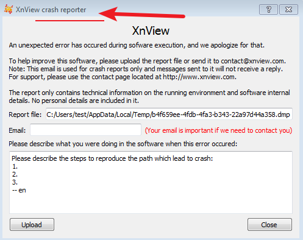

Two issues were found in XnView in all versions. I tested XnView MP Version 0.96.4 (Jun 30 2020).  XnView does not handle the two file formats pict and ico well. When XnView opens carefully constructed pict and ico files, XnView will have a heap overflow vulnerability or denial of service (application crash)

# 1. pict file format,  heap overflow vulnerability
++++++++++++++++++++++++++++++++++++++++++++++++++++++++++++++  
(c70.edc): Access violation - code c0000005 (first chance)  
First chance exceptions are reported before any exception handling.  
This exception may be expected and handled.  
eax=ffff0003 ebx=10263f3b ecx=00003dff edx=00000000 esi=76735a81 edi=10260000  
eip=77122d94 esp=02f4e588 ebp=02f4e5bc iopl=0         nv up ei pl nz na pe nc  
cs=001b  ss=0023  ds=0023  es=0023  fs=003b  gs=0000             efl=00010206  
ntdll!RtlpLowFragHeapFree+0xc5:  
77122d94 8930            mov     dword ptr [eax],esi  ds:0023:ffff0003=????????  
0:009> !exploitable -v  

!exploitable 1.6.0.0  
HostMachine\HostUser  
Executing Processor Architecture is x86  
Debuggee is in User Mode  
Debuggee is a live user mode debugging session on the local machine 
Event Type: Exception  
Exception Faulting Address: 0xffffffffffff0003  
First Chance Exception Type: STATUS_ACCESS_VIOLATION (0xC0000005)  
Exception Sub-Type: Write Access Violation   

Faulting Instruction:77122d94 mov dword ptr [eax],esi   

Exception Hash (Major/Minor): 0xf29e89e5.0xac5819b3   

 Hash Usage : Stack Trace:  
Excluded    : ntdll!RtlpLowFragHeapFree+0xc5  
Excluded    : ntdll!RtlFreeHeap+0x105  
Major+Minor : ucrtbase!free_base+0x1b  
Major+Minor : ucrtbase!free+0x18  
Major+Minor : xnviewmp+0x52b165  
Major+Minor : xnviewmp+0x52ac50  
Major+Minor : xnviewmp+0x52a47d  
Minor       : xnviewmp+0x4d4640  
Minor       : xnviewmp+0x4d44d2  
Minor       : xnviewmp+0x4d8735  
Minor       : xnviewmp+0x4d869c  
Minor       : xnviewmp+0x305a61  
Minor       : xnviewmp+0x30569e  
Minor       : xnviewmp+0x3f3b58  
Minor       : xnviewmp+0x3f43ee  
Minor       : xnviewmp+0x3f56f1  
Minor       : Qt5Core!QThread::start+0x31c  
Minor       : kernel32!BaseThreadInitThunk+0xe  
Minor       : ntdll!__RtlUserThreadStart+0x70  
Minor       : ntdll!_RtlUserThreadStart+0x1b  
Instruction Address: 0x0000000077122d94  

Description: User Mode Write AV  
Short Description: WriteAV  
Exploitability Classification: EXPLOITABLE  
Recommended Bug Title: Exploitable - User Mode Write AV starting at    ntdll!RtlpLowFragHeapFree+0x00000000000000c5 called from     ucrtbase!free_base+0x000000000000001b (Hash=0xf29e89e5.0xac5819b3)    

User mode write access violations that are not near NULL are exploitable.    

++++++++++++++++++++++++++++++++++++++++++++++++++++++++++++++

# 2. ico file format
*************************************************************************
(84c.c0): Access violation - code c0000005 (first chance) 
First chance exceptions are reported before any exception handling. 
This exception may be expected and handled. 
eax=03afe7df ebx=00000000 ecx=03a605e0 edx=00000000 esi=03a60878 edi=00000000 
eip=76cbf817 esp=001b9ec8 ebp=001b9f08 iopl=0         nv up ei pl nz na pe nc 
cs=001b  ss=0023  ds=0023  es=0023  fs=003b  gs=0000             efl=00010206 
USER32!SmartStretchDIBits+0x33: 
76cbf817 8a00            mov     al,byte ptr [eax]          ds:0023:03afe7df=?? 
0:000> !exploitable -v 

!exploitable 1.6.0.0 
HostMachine\HostUser 
Executing Processor Architecture is x86 
Debuggee is in User Mode 
Debuggee is a live user mode debugging session on the local machine 
Event Type: Exception 
*** ERROR: Module load completed but symbols could not be loaded for xnviewmp.exe
*** WARNING: Unable to verify checksum for C:\Program Files\XnViewMP\Qt5Core.dll
*** ERROR: Symbol file could not be found.  Defaulted to export symbols for C:\Program Files\XnViewMP\Qt5Core.dll -  
*** WARNING: Unable to verify checksum for C:\Program Files\XnViewMP\Qt5Widgets.dll
*** ERROR: Symbol file could not be found.  Defaulted to export symbols for C:\Program Files\XnViewMP\Qt5Widgets.dll -  
*** WARNING: Unable to verify checksum for C:\Program Files\XnViewMP\Qt5Gui.dll
*** ERROR: Symbol file could not be found.  Defaulted to export symbols for C:\Program Files\XnViewMP\Qt5Gui.dll - 
Exception Faulting Address: 0x3afe7df 
First Chance Exception Type: STATUS_ACCESS_VIOLATION (0xC0000005) 
Exception Sub-Type: Read Access Violation 

Faulting Instruction:76cbf817 mov al,byte ptr [eax] 

Basic Block: 
    76cbf817 mov al,byte ptr [eax] 
       Tainted Input operands: 'eax' 
    76cbf819 mov byte ptr [ebp-19h],al 
       Tainted Input operands: 'al' 
    76cbf81c mov dword ptr [ebp-4],0fffffffeh 
    76cbf823 lea eax,[ebp-30h] 
    76cbf826 push eax  
    76cbf827 push 1 
    76cbf829 push ebx 
    76cbf82a push dword ptr [ebp+8] 
    76cbf82d call dword ptr [user32!_imp__getdibcolortable (76cb1304)] 

Exception Hash (Major/Minor): 0xd8ac75a9.0xec2ace5f 

 Hash Usage : Stack Trace: 
Major+Minor : USER32!SmartStretchDIBits+0x33 
Major+Minor : USER32!BitmapFromDIB+0x1cc 
Major+Minor : USER32!ConvertDIBBitmap+0x12b 
Major+Minor : USER32!ConvertDIBIcon+0x112 
Major+Minor : USER32!CreateIconFromResourceEx+0x87 
Minor       : USER32!IconFromBestImage+0x215 
Minor       : USER32!RtlLoadObjectFromDIBFile+0x217 
Minor       : USER32!ObjectFromDIBResource+0x2a  
Minor       : USER32!LoadIcoCur+0x197 
Minor       : USER32!LoadImageInternal+0x7c 
Minor       : USER32!LoadImageW+0x22 
Minor       : USER32!ExtractIconFromICO+0x30 
Minor       : USER32!PrivateExtractIconsW+0x2f5 
Minor       : SHELL32!SHPrivateExtractIcons+0x383 
Minor       : SHELL32!SHDefExtractIconW+0x1d6 
Minor       : SHELL32!CFSFolderExtractIcon::_ExtractW+0x2d 
Minor       : SHELL32!CExtractIconBase::Extract+0x1f 
Minor       : SHELL32!IExtractIcon_Extract+0x36 
Minor       : SHELL32!_GetILIndexGivenPXIcon+0x1e6 
Minor       : SHELL32!_GetILIndexFromItem+0x74 
Minor       : SHELL32!_GetFileInfoSections+0x160 
Minor       : SHELL32!SHGetFileInfoW+0x18f 
Minor       : xnviewmp+0x31ea5c 
Minor       : xnviewmp+0x31b6e2 
Minor       : xnviewmp+0x3b9e1b 
Minor       : xnviewmp+0x3b89f7 
Minor       : xnviewmp+0x3b77a8 
Minor       : xnviewmp+0x446a20 
Minor       : Qt5Core!QMetaObject::activate+0x4d5 
Minor       : Qt5Core!QMetaObject::activate+0x1e 
Minor       : xnviewmp+0x39e42e 
Minor       : xnviewmp+0x44806c 
Minor       : Qt5Core!QMetaCallEvent::placeMetaCall+0x52 
Minor       : Qt5Widgets!QWidget::event+0xd24 
Minor       : Qt5Core!QEventDispatcherWin32::`default constructor closure'+0x16a 
Minor       : Qt5Widgets!QApplicationPrivate::notify_helper+0x10a 
Minor       : Qt5Widgets!QApplication::notify+0x1a7e 
Excluded    : ntdll!RtlpAllocateHeap+0xe73 
Excluded    : ntdll!RtlAllocateHeap+0x23a 
Minor       : Qt5Core!QEventDispatcherWin32::wakeUp+0x4c 
Minor       : Qt5Gui!QWindowSystemInterface::handleWindowStateChanged<QWindowSystemInterface::SynchronousDelivery>+0x12b 
Instruction Address: 0x0000000076cbf817 

Description: Read Access Violation 
Short Description: ReadAV 
Exploitability Classification: UNKNOWN 
Recommended Bug Title: Read Access Violation starting at  USER32!SmartStretchDIBits+0x0000000000000033 (Hash=0xd8ac75a9.0xec2ace5f) 

*************************************************************************
